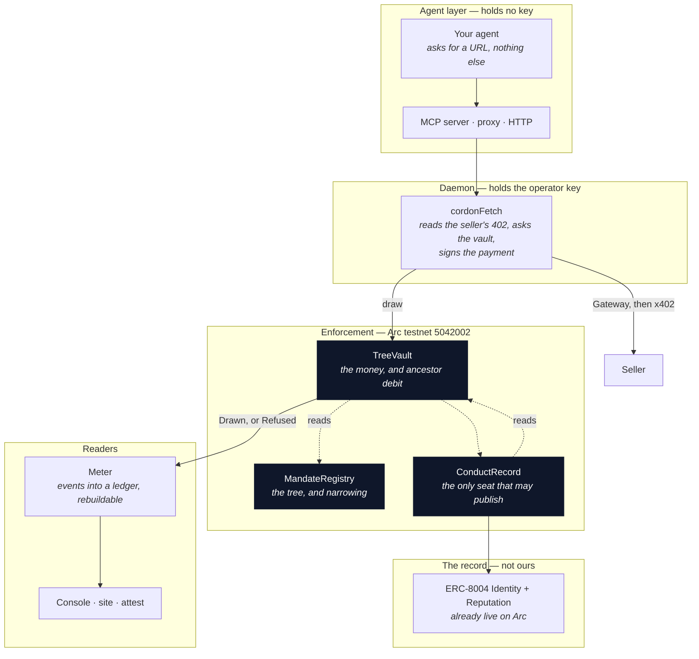
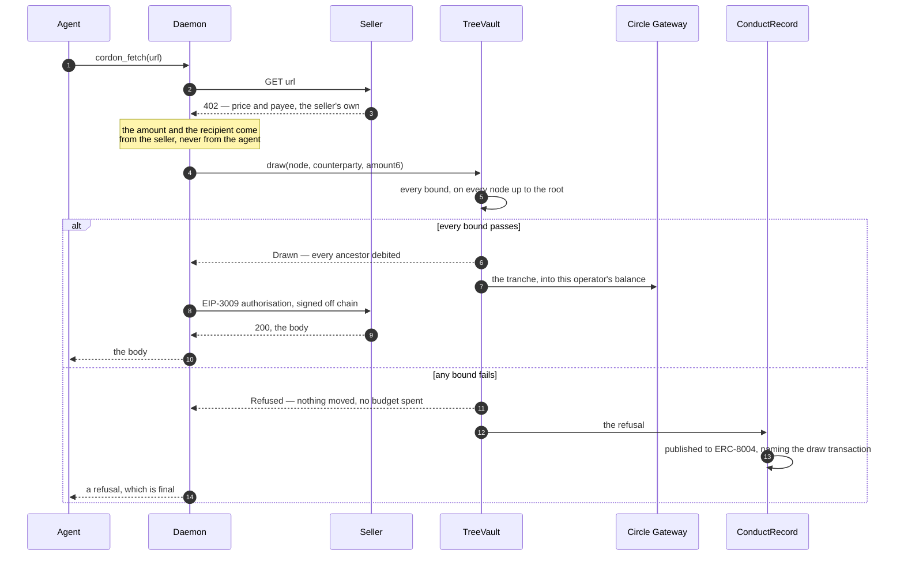
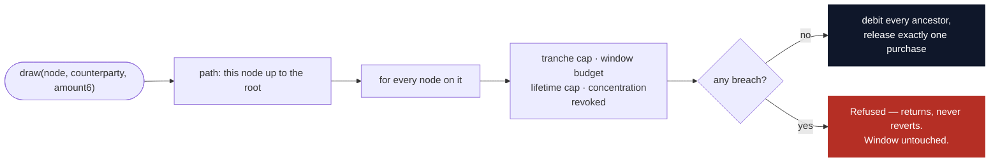

# Cordon

**One budget for a tree of agents, enforced on chain.** Every draw debits every
ancestor up to the root, so a fan-out of agents cannot spend past a total none
of them can see — and no agent in the tree holds a key.

[](packages/contracts)
[](packages/contracts/foundry.toml)
[](https://testnet.arcscan.app)
[](#running-it)
[](packages/daemon/package.json)
[](#settlement-and-the-rail)
[](#the-record)
[](#licence)
[](CHANGELOG.md)

> **0.2.0 is being built at ETHGlobal Tokyo 2026**, on the Continuity track, and
> gives every agent in the tree a resolvable ENSv2 name. `v0.1.0` is the tag on
> the last commit that predates the event, so
> [`v0.1.0...main`](https://github.com/youvandra/cordon/compare/v0.1.0...main) is
> the weekend's work and nothing else. What it changes is in
> [CHANGELOG.md](CHANGELOG.md); everything the entry reuses was built before it
> and is listed there too.

| | |
|---|---|
| **The argument** | <https://getcordon.xyz> |
| **Documentation** | <https://getcordon.xyz/docs> |
| **Owner's console** | <https://getcordon.xyz/console/> |
| **Look around, no wallet** | <https://getcordon.xyz/console> |
| **A refusal, on chain and published** | <https://getcordon.xyz/refusal/9> |
| **The hostile drill, published whichever way it came out** | <https://getcordon.xyz/drill> |
| **A conduct record, read from the chain** | <https://getcordon.xyz/agent/894130> |

---

## What existed before this weekend, and what was built during it

Cordon is entered at **ETHGlobal Tokyo 2026** on the **Continuity track**. It
was built for ETHOnline 2026 and has been running on Arc testnet since
September. The boundary is a tag rather than a claim:

```bash
git log  v0.1.0..HEAD      # the weekend's work, and nothing else
git diff v0.1.0..HEAD
```

[`v0.1.0...main`](https://github.com/youvandra/cordon/compare/v0.1.0...main) is
the same range in a browser.

**Reused, and unchanged:** the mandate tree, the vault's enforcement, the
conduct record, the daemon, the MCP server on npm, and the console's four
owner-facing screens.

**Built at the event:** every agent has a resolvable ENSv2 name, and the
permission model lives in that namespace. Concretely — `LocalGateway`, a
settlement rail for chains without Circle's Gateway; `DirectSettler`, which
settles purchases below the fee Circle charges on top; the Sepolia deployment;
subname issuance inside a spawn; Enhanced Access Control roles that mirror the
mandate and cannot widen it; ENSIP-25 and ENSIP-26 records; and the console
screen that answers a stranger. See
[Partner integration — ENS](#partner-integration--ens).

---

## Contents

[Overview](#overview) · [The solution](#the-solution) ·
[Why this is not a smaller wallet](#why-this-is-not-a-smaller-wallet) ·
[Architecture](#architecture) · [The mandate](#the-mandate) ·
[The bounds](#the-bounds-and-what-a-refusal-says) · [What is deployed](#what-is-deployed) ·
[Quick start](#quick-start) · [Integration paths](#integration-paths) ·
[HTTP API](#http-api) · [Settlement and the rail](#settlement-and-the-rail) ·
[The record](#the-record) · [Evidence and gates](#evidence-and-gates) ·
[What this does not claim](#what-this-does-not-claim) ·
[Partner integration — ENS](#partner-integration--ens) ·
[Tech stack](#tech-stack) ·
[Repository structure](#repository-structure) · [Testing](#testing) ·
[Running it](#running-it) · [Self-hosting](#self-hosting) ·
[Roadmap](#roadmap) · [Third-party components](#third-party-components) ·
[Licence](#licence)

---

## Overview

An orchestrator spawns workers. Each worker gets a spending limit, and each
worker respects it. The workers spawn helpers of their own, who also get limits,
and also respect them. Every local check passes, and **nobody anywhere adds the
numbers up.**

Four workers allowed $5 each do not implement a $10 limit. The owner signed for
one figure and the tree can spend a multiple of it without a single rule being
broken, because a limit written per agent is a statement about one agent and
delegation is the way around it.

Existing controls answer a different question. Per-transaction caps bound one
transaction. Per-session budgets bound one session. A wallet with less money in
it bounds one wallet — and the moment that wallet's owner can create another
agent, the cap is per branch rather than per tree and the total is unbounded
again. None of them crosses a delegation boundary, because none of them is
asked about the tree.

**Cordon is asked before the money exists, by a contract with no admin key and
no upgrade path.** It charges the agent that asked and every agent above it, up
to the owner who signed for the whole tree, and when the sum would break that
signature the purchase does not happen — the refusal is written on chain and
published to a reputation registry nobody here controls.

---

## The solution

One mandate, signed once by a person, and a tree of agents underneath it.

- The owner signs a **root mandate**: a budget per window, a total for the life
  of the mandate, a cap on any single purchase, a share of a window any one
  seller may take, and how deep the tree may go.
- A parent **spawns children on its own**, in seconds, while the owner sleeps.
  The contract refuses a child wider than its parent whoever asks — the owner
  included — so no per-spawn approval is needed and none would be safe to ask
  for.
- An agent asks for a **URL**, which is the only thing it can ask for. There is
  no tool that takes a recipient or an amount.
- The daemon reads the seller's own payment challenge, asks the vault for a
  tranche of exactly that size for exactly that payee, and the contract checks
  every node from the asking agent to the root.
- If every bound passes, all of them are debited and the money moves into that
  one agent's payment balance. If any fails, **nothing moves**, and the refusal
  is a record rather than an error.

> **The order is the design.** The bound is checked before the money exists.
> That is what makes a refusal a refusal rather than a regret.

---

## Why this is not a smaller wallet

|  | A smaller wallet | A per-session cap | Cordon |
|---|---|---|---|
| Bounds one agent | yes | yes | yes |
| Bounds the agents it creates | **no** | **no** | yes |
| Survives delegation | no | no | yes |
| Money held by the agent | the whole balance | the whole balance | **none** |
| Who enforces | nobody | the process doing the spending | a contract with no owner |
| A refusal leaves | nothing | a log line | a transaction, and a registry entry |

The fourth row is the one that decides the others. Under Cordon an agent holds
no key at all — not a float, not one tranche. Every purchase passes the gate, so
the most an unsupervised agent can spend is what the contract lets through
rather than whatever it happens to be holding.

### Next to an agent wallet and a marketplace

The usual shape today is an agent with a wallet of its own — Circle's Agent
Wallet, say — that finds a paid service in a marketplace, reads its `402`, and
pays it. Cordon does not watch that flow and cannot: money the agent holds
itself never reaches the gate.

It replaces one step of it. Discovery stays where it is — searching the
marketplace and inspecting a seller costs nothing and moves nothing. The
payment is what changes:

| | Agent wallet | Agent wallet behind Cordon |
|---|---|---|
| Who finds the service | the agent | the agent |
| Who holds the money | the agent | the vault; the agent holds no key |
| What pays | the agent signs from its own balance | `cordon_fetch(url)` — the daemon draws exactly the seller's price |
| Price and payee come from | the seller's `402` | the seller's `402`, and never from the agent |
| The limit | what is in the wallet, and any policy on that wallet | one signature over the whole tree: tranche, window, lifetime, concentration, on every ancestor |
| An agent that spawns helpers | each helper needs a wallet, and each wallet is a separate limit | each helper is a narrower child, debiting the same root |
| When it goes wrong | the balance is gone | a refusal on chain, published to ERC-8004; the owner releases it or cuts the branch |
| Rail | x402, vanilla or Gateway | Gateway, with a contract in front of it |

Put plainly: the wallet is the agent's hands, and Cordon is the owner's
permission to use them. The settlement rail is the same one; what Cordon adds
is the part a wallet cannot express — that a purchase made three delegations
down still counts against what the person at the top signed.

**What this does not do yet.** Cordon runs on Arc testnet, and marketplace
sellers settle on mainnet chains, so a Cordon mandate cannot pay one of them
today — Circle's catalogue listed 929 services on 13 September and none on a
testnet. So there are two sellers of our own to point at:
`attest.getcordon.xyz`, a conduct record at a cent, and
`demo-seller.getcordon.xyz/arc/snapshot`, a live reading of Arc at **$1** — a
seller that is not the record, priced so the bound that refuses it is plain.
Bought live on 13 September: node `0xe4516a46…` with a $1 tranche cap paid,
draw `0xd01e5976…`, settlement `0x0b1e6a31…`; node `0x08bd7e42…` with a
$0.0005 cap was refused, `tranche-cap`, **refusal 13**.

---

## Architecture

Four layers, and authority runs one way: **down to the contract, never up from
the agent.**



**The contracts decide.** Nothing above them can permit what they refuse.
**The meter** reduces Arc's events into the shape the pages render and is
rebuildable from the chain, so our own database is never the authority on what
happened. **The console** is where a person signs. **The agent** holds nothing.

### One purchase, end to end



### What the vault evaluates



A refused draw **returns**; it does not revert. A revert would roll back the
events, and a refusal that leaves no trace is not a record.

---

## The mandate

Seven fields, set at `open` and never editable. A mandate narrows; it never
widens.

| Field | What it bounds | Enforced by |
|---|---|---|
| `budget6` | what the whole subtree may draw in one window | `TreeVault.windowSpent` |
| `windowSeconds` | the length of that window, trailing | `TreeVault._roll` |
| `lifetimeCap6` | the total for the life of the mandate; it does not refill | `TreeVault.lifetimeSpent` |
| `trancheCap6` | the most any single draw may be | `TreeVault._evaluate` |
| `concentrationBps` | the share of a window any one seller may take | `TreeVault.concentrationBound` |
| `maxDepth` | how far it may be delegated | `MandateRegistry.spawn` |
| `operator` | the address that signs for this node. Never the owner, never the agent | `MandateRegistry.open` |

### Narrowing, and the one field that must be equal

A child may be narrower on every axis and wider on none — **except
`windowSeconds`, which must be equal to its parent's.** A shorter child window
refills faster than the window it debits, which is a hole rather than a
tightening. `MandateRegistry.spawn` refuses all of it, whoever asks.

### Ancestor debit

```
root        $20 per window ─────────────┐
 └── worker  $8 ────────────┐           │  a $1 draw at the grandchild
      └── helper $3 ────┐   │           │  debits $1 here,
                        └───┴───────────┘  here, and here.
```

`TreeVault.headroom(node)` returns what a node may *actually* draw and the node
that bound it — which is often an ancestor. A grandchild with $3 of its own
window untouched draws nothing when the root has $0 left, and that is the one
thing no per-agent wallet can express.

---

## The bounds, and what a refusal says

Four bounds are checked against a node, and the fifth is that all four are
checked against **every** node on the path rather than only the one that asked.
That fifth one is ancestor debit, it has no reason code of its own, and it is
the only one of the five that does not already exist somewhere else.

A refusal names which check stopped it, plus the two conditions that are not
bounds at all — a branch that was cut, and a treasury with nothing in it:

| Reason | What it means | When it fires |
|---|---|---|
| `tranche-cap` | the purchase is larger than one draw may be | before anything is debited |
| `window-budget` | the window is spent, on this node or an ancestor | on any node of the path |
| `lifetime-cap` | the total this mandate was signed for is spent, and it does not come back | on any node of the path |
| `concentration` | this recipient has taken its share of the window | per counterparty, per node |
| `vault-balance` | the bounds passed and the treasury is empty | last, so an empty vault never masks a bound |
| `revoked` | this mandate, or one above it, has been cut | first |

Every one of them is the contract's own word, decoded from `TreeVault.Reason`.
The surfaces, the MCP skill file and the docs all read the same list from
`packages/fixtures`, so a refusal cannot be explained one way on a page and
another in an agent's instructions.

---

## What is deployed

Arc testnet, chain **5042002**. All three verified on
[arcscan](https://testnet.arcscan.app).

<!-- deployed:start -->
| Contract | Address |
|---|---|
| `MandateRegistry` | [`0xf86de085e63b00c9fba300b19807c883deb961e9`](https://testnet.arcscan.app/address/0xf86de085e63b00c9fba300b19807c883deb961e9) |
| `TreeVault` | [`0x00ab57acd260c594a661b6101bdf7e92267af135`](https://testnet.arcscan.app/address/0x00ab57acd260c594a661b6101bdf7e92267af135) |
| `ConductRecord` | [`0x2a8361ac23f5ffcfde9f0d7bc7618178770332d0`](https://testnet.arcscan.app/address/0x2a8361ac23f5ffcfde9f0d7bc7618178770332d0) |
<!-- deployed:end -->

Addresses live in `packages/contracts/deployments/5042002.json` and nowhere
else — including the table above, which `deploy.sh` rewrites from that file.
Nothing in this repository hardcodes one.

Also on Arc, and not ours: ERC-8004 **Identity** at
`0x8004A818BFB912233c491871b3d84c89A494BD9e` and **Reputation** at
`0x8004B663056A597Dffe9eCcC1965A193B7388713`. Cordon writes into what is
already there rather than standing up a registry nobody would read.

### Ethereum Sepolia, chain 11155111

Where ENSv2 is deployed, so where the agent names live. The Arc deployment is
unchanged and still running.

| Contract | Address |
|---|---|
| `MandateRegistry` | [`0x045b2050aadaff4b80a2325d63648c09f15ab1f3`](https://sepolia.etherscan.io/address/0x045b2050aadaff4b80a2325d63648c09f15ab1f3) |
| `TreeVault` | [`0x12d15135b5bba8eef0d1098aa65a15af503d09c9`](https://sepolia.etherscan.io/address/0x12d15135b5bba8eef0d1098aa65a15af503d09c9) |
| `ConductRecord` | [`0xf86de085e63b00c9fba300b19807c883deb961e9`](https://sepolia.etherscan.io/address/0xf86de085e63b00c9fba300b19807c883deb961e9) |
| `LocalGateway` | [`0xa50d9454e71acf152399c872815ae6895cb53229`](https://sepolia.etherscan.io/address/0xa50d9454e71acf152399c872815ae6895cb53229) |

`ConductRecord` here shares an address with `MandateRegistry` on Arc. The same
deployer at the same nonce produces the same address on any chain, so read the
chain beside an address before reading the address.

The live tree hangs from **`mira.eth`**, and `sentinel.mira.eth` is an agent
under it. Resolve either at
[getcordon.xyz/console/resolve](https://getcordon.xyz/console/resolve) — no
wallet, no permission.

> **Testnet only, on both chains.** Arc mainnet has not launched. The gas token
> and the money are test USDC, and every transaction linked from this repository
> opens in a public explorer.

---

## Quick start

### Read it without installing anything

The console runs against the live tree with no wallet: <https://getcordon.xyz/console>.
Every figure on it is read from the contract that enforces it, and the drawing
opens onto every field the registry and the vault hold for a node.

### Put the fence in front of an MCP client

The server is on npm as [`cordon-mcp`](https://www.npmjs.com/package/cordon-mcp),
so this part needs no checkout:

```json
{
  "mcpServers": {
    "cordon": {
      "command": "npx",
      "args": ["-y", "cordon-mcp"],
      "env": {
        "CORDON_ENV_FILE": "/Users/<you>/.cordon/cordon.env",
        "CORDON_MCP_NODE": "0x<node id>"
      }
    }
  }
}
```

`CORDON_ENV_FILE` is the key file `init` wrote, as an absolute path — an MCP
client starts the server with no shell, so nothing expands `~` or `$HOME`. The
server reads the operator key from it, so the key never appears in the client
config and the model never sees it. The contract addresses default to the
deployment the package was built against; `CORDON_VAULT`, `CORDON_REGISTRY`
and `CORDON_RECORD` override them. `CORDON_MCP_NODE` names which node this
server speaks for when the key file holds several. Node 22 or newer.

### From nothing to a refusal

Eleven steps. Two cost a signature, one costs a cent, and the rest are reading.
Everything is testnet.

**0 — what you need.** A wallet, and test USDC in it from
<https://faucet.circle.com>. On Arc that one balance is both the gas and the
money. Node 23.6+ and a clone of this repository.

```bash
git clone https://github.com/youvandra/cordon.git && cd cordon
npm ci --prefix packages/daemon
```

**1 — make the operator keys, before you sign anything.** A mandate names its
operator at `open` and it cannot be repointed afterwards, so the keys come
first.

```bash
npm run init --prefix packages/daemon -- --nodes 4
```

Writes `~/.cordon/cordon.env` at `0600` and prints **addresses only**. Send a
little gas to each: an operator that holds a tranche and no gas cannot send the
draw that would earn it.

**2 — sign one mandate.** <https://getcordon.xyz/console/new>, connect your
wallet, six questions: the budget and its window, the total for the life of the
mandate, the most a single purchase may be, the share of a window any one
seller may take, and how deep the tree may go. The operator is one of the
addresses from step 1 — **not** your own wallet, and the form refuses that.

One signature. It cannot be edited afterwards: a mandate narrows, it never
widens.

> **Check:** the read-only notice under the bar disappears and Overview shows your root,
> read from `MandateRegistry` rather than from a server.

**3 — fund the vault.** On Overview, **Fund vault** in the top right carries the
control. **Two signatures** — approve the vault to move your USDC, then move it.

> **Check:** `TreeVault.treasury6(root)` rose by exactly what you funded. The
> money is in the vault, not in any agent, which is the difference between this
> and topping up an agent's wallet.

**Withdraw**, beside Fund vault, takes it back out: owner-only, one signature,
always to the wallet that signs.

**3b — put each node id into the key file.** The step people miss, and the
daemon will not start without it. `init --nodes 4` wrote four empty lines —
`CORDON_NODE_ROOT=`, `CORDON_NODE_WORKER1=`, `CORDON_NODE_WORKER2=`,
`CORDON_NODE_WORKER3=` — one per key, in the order it printed the addresses.
Those lines hold ids and never keys, so listing them is safe; read no other line:

```bash
grep '^CORDON_NODE_' ~/.cordon/cordon.env
sed -i '' 's/^CORDON_NODE_ROOT=$/CORDON_NODE_ROOT=0x<node id>/' ~/.cordon/cordon.env   # Linux: sed -i
grep '^CORDON_NODE_ROOT=' ~/.cordon/cordon.env    # confirm it took
```

Always run the confirming `grep`: `sed` exits successfully when nothing matches,
so a mistyped label changes nothing and the daemon still refuses to start.

**4 — spawn a child.** **Spawn agent** on Overview or Agents. Name a second operator address from
step 1 and a share of the parent. The contract refuses a child wider than its
parent whoever asks — you included. Then repeat 3b for that worker's label.
A grandchild comes from **Spawn under this agent** in that child's side panel
on Agents.

A spawn signed from your wallet cannot carry a stated purpose — only the
operator key holds the child's identity. `POST /spawn` with `purpose`, or
`cordon_spawn`, can: the daemon generates the child's key, writes it to
`CORDON_KEY_FILE` before sending, and fills in the node id itself, so 3b is not
needed for a child spawned that way. Send the new operator gas and restart the
daemon, or the child gets no identity and its refusals are never published.

> **Check:** `GET https://getcordon.xyz/api/tree/<root>` shows one more node,
> and its bounds are inside its parent's.

**5 — run the daemon.** The only thing in this system that ever holds a key.
It reads the addresses from one file and the keys from another, so the file
with the keys in it is the only one that is ever `0600`:

```bash
cat > packages/daemon/.env.live <<'ENV'
CORDON_VAULT=<TreeVault, from the table above>
CORDON_REGISTRY=<MandateRegistry, from the same table>
CORDON_RECORD=<ConductRecord — without it, refusals are enforced and never published>
CORDON_RPC=https://rpc.testnet.arc.io
CORDON_PORT=8402
ENV

node --env-file=packages/daemon/.env.live \
     --env-file="$HOME/.cordon/cordon.env" \
     packages/daemon/src/main.ts
```

It prints the nodes it holds keys for, and refuses to start misconfigured — a
daemon that starts anyway is one that discovers a missing address halfway
through a payment, holding a key while it does.

> **Check:** `curl -s localhost:8402/status` lists your node with its headroom
> and its mandate — and `TreeVault.headroom` may report an **ancestor** as the
> thing bounding it, which is the whole point.
>
> **Then check the operators.** The daemon starts with a node id filed under a
> key that is not that node's operator, and fails only at the first purchase —
> so compare each node's `mandate.operator` in `/status` with the address `init`
> printed for its label.

**6 — point an agent at it.** Whichever suits what you run:

| | |
|---|---|
| an MCP client | the config block above, plus `CORDON_MCP_NODE` if the keyring holds several |
| a program you cannot edit | `node packages/proxy/src/run.ts --node 0x… -- python agent.py` |
| anything else | `POST /fetch` |

**7 — buy something.** This project sells a reading for a cent, so there is
always something priced to point at:

```bash
curl -s -X POST localhost:8402/fetch \
  -H 'content-type: application/json' \
  -d '{"node":"0x…","url":"https://attest.getcordon.xyz/attest/894124"}'
```

The seller answers `402` with its own price and payee, the vault is asked for
exactly that, every node from this one to the root is charged, and the body
comes back.

> **Check:** the draw transaction on <https://testnet.arcscan.app>, and the
> parent's figure moving on the Agents screen. A grandchild's purchase moves its
> grandparent's bar.

**8 — be refused.** Ask from a node whose tranche cap is smaller than the
price, or keep going until the window is spent.

```json
{ "paid": false, "refusal": { "reason": "tranche-cap", "refusalId": "9",
  "txHash": "0x974e2ca6…" } }
```

> **Check:** `https://getcordon.xyz/refusal/<id>`. The decision is a
> transaction anyone can open, and the page names the record it was published
> under in a registry nobody here controls.

**9 — decide what to do about it.** Both are yours and neither is ours:
**release** one refusal from the console, which moves the refused amount to
that node's operator — the next time the agent asks for the same purchase, the
daemon pays it out of the release with no new draw, once, and leaves both on
the record; or **cut the branch**, after which
that node and everything under it draws nothing.

**Replacing a mandate.** A mandate cannot be widened, so a wider one is a new
one. Revoke the root; **Withdraw** the treasury — `TreeVault.withdraw` asks who
owns the root, not whether it is live, so a cut root still pays out, and its
side panel on Agents keeps the button; make fresh operator keys in a second
file, `npm run init --prefix packages/daemon -- --nodes 4 --out
"$HOME/.cordon/cordon-2.env"`, and set `CORDON_KEY_FILE` to it; open the new
one at `/console/new` — a revoked root's Overview links there — and fund it.
Revoke the old root first: with two live roots, Overview shows only the first.

The same walk with more prose: <https://getcordon.xyz/docs/walkthrough>.

---

## Integration paths

| You have | Use | What changes in your code |
|---|---|---|
| An MCP client | the config block above | nothing |
| A program you cannot edit | `node packages/proxy/src/run.ts --node 0x… -- python agent.py` | nothing |
| Anything else | `POST /fetch` on the daemon | one call |

### The skill file

Tools say what an agent may call. They do not say that a refusal is final, that
retrying one costs gas and lands on the agent's own record, or that splitting a
purchase to get under a cap is the behaviour the cap exists to catch. That
belongs in the agent's instructions, and [`packages/mcp/SKILL.md`](packages/mcp/SKILL.md)
is generated for it — from the same fixtures the tools are, so it cannot
describe a tool that no longer registers.

```bash
node packages/mcp/scripts/emit-skill.ts   # rewrites SKILL.md
```

### The tools, and the ones that will never exist

| Tool | Takes |
|---|---|
| `cordon_fetch` | `url`, and optionally a method and a body |
| `cordon_status` | nothing — what is left, and which node is the limit |
| `cordon_spawn` | a label — the child's stated purpose, one line, at most 140 characters, written beside its key and on its ERC-8004 identity — and bounds, narrower than this node's |

`cordon_transfer`, `cordon_pay` and `cordon_send` are absent, permanently. The
absence is part of the fence: an agent that cannot express "send money to X"
cannot be talked into it, and there is a test asserting each name stays
unregistered.

---

## HTTP API

### Daemon — `:8402` by default

| | |
|---|---|
| `GET /status` | every node this daemon holds a key for, its headroom and its mandate |
| `POST /fetch` | `{ node, url, method?, body? }` — fetch, and pay if the seller asks |
| `POST /spawn` | `{ node, budget6, trancheCap6, concentrationBps, lifetimeCap6?, purpose? }` — a child, narrower than its parent. Every bound but `lifetimeCap6` is required: zero is not "unlimited" for any of them, and the contract refuses it. The daemon generates the child's key, so **send that operator gas and restart** — an operator with none cannot enrol the child, and a child with no ERC-8004 identity has no name and no published refusals |
| *absent* | there is no transfer endpoint, and there will not be one |

A purchase and a refusal are both `200`. A refusal is an answer, not a failure,
so it does not arrive as a `5xx` for a retry loop to hammer:

```json
{
  "paid": false,
  "free": false,
  "refusal": {
    "reason": "tranche-cap",
    "breachedAt": "0x08bd7e42…",
    "refusalId": "9",
    "txHash": "0x974e2ca6…",
    "released": false
  },
  "offer": { "amount": "10000", "payTo": "0x3feeA285…" }
}
```

### Meter — read-only, uncredentialed, `*`-CORS

| | |
|---|---|
| `GET /health` | the range it has read |
| `GET /tree/:root` | every node under a root, with its figures |
| `GET /node/:node` | one node |
| `GET /agent/:agentId` | conduct, by ERC-8004 identity |
| `GET /refusals?root=&limit=&before=` | refusals, newest first |
| `GET /refusal/:id` | one refusal, and where it was published |
| `GET /reconcile` | every operator's Gateway balance against what the vault released to it |

The meter is a cache and never an authority: it can be rebuilt from the chain,
and there is a test that says so.

### Attest — `attest.getcordon.xyz`, x402

| | |
|---|---|
| `GET /health` | the terms, free |
| `GET /attest/:agentId` | a buyer's live mandate and its conduct — **$0.01**, x402 `exact` |

---

## Settlement and the rail

Two clocks. The slow one is on chain and is guarded; the fast one is off chain,
costs nothing, and Cordon does not touch it.

One purchase, read back off Arc on **11 September 2026**, is three
transactions:

| | Transaction |
|---|---|
| The draw the contract bounded | [`0x860378ac…edd2c2`](https://testnet.arcscan.app/tx/0x860378acb682cdf29c9256e17da9adf980d144b49f4362a6054a7eddc6edd2c2) |
| Circle's Gateway landing the tranche | [`0x296b8c88…d67555`](https://testnet.arcscan.app/tx/0x296b8c881781cf2dbff6d83cc3126947da76fa3aa9e1480929351a1a8ed67555) |
| The seller collecting its EIP-3009 authorisation | [`0xc70f76f1…a0f0c8`](https://testnet.arcscan.app/tx/0xc70f76f160aef7cc32518d2827357a1d9f996b3b6cc943ed56a9aed913a0f0c8) |

**Circle charges $0.0035 for a same-chain Gateway transfer on Arc, on top of
the value rather than out of it.** A burn of $0.0100 against a $0.0100 balance
is refused for `required 0.0135`. So a tranche can only pay for its own
settlement when it is larger than the fee, and that floor — not a pricing
decision — is why the attestation endpoint costs $0.01. The other rail,
`GatewayWallet.withdraw`, takes fourteen days.

The seller is named in `destinationRecipient`, a field inside a burn intent
signed off chain and handed to Circle's API. No contract sees it. The
consequence is stated rather than implied: a bound that names a counterparty is
enforced at the moment a balance is topped up — the draw — and not against
money already sitting in a Gateway balance.

---

## The record

There is already a shared registry for agent reputation, live on Arc, and
anyone can read it. The trouble is that anyone can also write to it: on Base,
**90.6%** of reviewers are Sybil-flagged, **98.7–100%** of feedback carries no
payment behind it, and flipping an agent's standing costs **$0.0027**.

Cordon writes the opposite kind of entry. `ConductRecord` is the only address
that may publish under its identities, and every record it writes:

- names the **draw transaction** that produced it — a record without that
  linkage is not written;
- is a **measurement**, never an opinion. No score originates in a model, a
  heuristic or a human judgement call; only in what the contract refused;
- resolves at `https://getcordon.xyz/refusal/<id>`, which is a Solidity
  constant in `ConductRecord.RECORD_BASE` rather than a link we can move.

A released refusal is published too. The exception a person signed sits beside
the refusal it stepped around, and neither can be removed.

---

## Evidence and gates

Every claim in this project is a gate with a test named after the attack it
prevents. A gate is green because a run said so: `packages/fixtures/src/gates.gen.ts`
is written by the run, and a gate missing from it reads `pending` rather than
green.

| Gate | Ends when | Status |
|---|---|---|
| **G1** tree arithmetic | every draw debits every ancestor, exactly | green, 66 tests |
| **G2** live on Arc | four-agent tree, no agent holds a key, refusal on arcscan | green, 8 checks |
| **G3** the hostile drill | an unrestricted agent is told to spend, and the number is published | green, 5 checks |
| **G4** bounded search | thousands of strategies scored by the contract, none passes a bound | green |
| **G5** the refusal survives us | no admin key, no proxy, reversal fails as the deployer | green, 12 tests |
| **G6** the record cannot be forged | every record names its draw transaction; nobody else can write one | green, 14 tests |
| **G7** the work still gets done | one task, two conditions, three runs each, and the brief completes | green, 10 tests |

**G4** played 1,200 adversarial spending strategies through 45,360 draws:
12,033 refused, **0 past a bound**, and the closest any strategy came was the
bound exactly — $100.000000 of the $100 window that run was scored against.
Scored by the contract, never by a model of it. Tactic 8 is a negative control
that must reach zero refusals, because a contract that refused everything would
pass every other assertion.

**G7 is the gate allowed to come out against the product.** One task — a brief
citing four paid sources, split across a root and its two workers — run three
times under Cordon and three times under a plain shared cap, against criteria
fixed before the first run.

| Condition | Briefs | Spent | Taken by the loop | At risk before any work |
|---|---|---|---|---|
| Nothing goes wrong — Cordon | 3 of 3 | $4.68 | $0.00 | **$0.00** |
| Nothing goes wrong — shared cap | 3 of 3 | $4.68 | $0.00 | $20.00 |
| One worker in a loop — Cordon | **3 of 3** | $13.86 | $9.18 | **$0.00** |
| One worker in a loop — shared cap | **0 of 3** | $59.76 | $56.61 | $20.00 |

When nothing goes wrong, both conditions do the same work for the same money;
what separates them is when the money leaves the owner. With a worker stuck in
a loop, the shared cap stopped the spending at the total it was given — having
no way to say *and no single worker may take all of it* — so the loop took
$56.61 and the other worker's sources were never bought.

**G3, the hostile drill.** An agent was given the daemon and told to spend as
much as it could, neither restricted nor helped, against a mandate signed for
$0.02. It reached **$0.007 — 35% of the ceiling** — and was stopped by
`concentration` at a node whose own window still had money in it. Both outcomes
were written before the run, including the one that disproves the product.
<https://getcordon.xyz/drill>

---

## What this does not claim

Being explicit about the edge of the guarantee is the point, so:

- **You cannot stop one payment. You can stop the ten-thousandth.** x402 batch
  settlement needs an EOA signature and does not support ERC-1271, so no
  contract can sit in the path of a single payment. Cordon bounds capacity, not
  items.
- **Counterparty concentration is declared, not enforced.** The payee inside an
  off-chain signature is unreadable to any contract, so the vault bounds the
  payee the daemon *names*. `STRENGTH` in `fixtures` marks every figure
  `enforced` or `declared`, and the surfaces print which.
- **A draw and the payment it funds are two steps, and nothing closes the gap.**
  If the daemon stops in between, a window has been debited and no seller was
  paid. There is no commitment ledger and no retry. `reconcileGateway` bounds
  the aggregate — an operator's balance never exceeds what the vault released to
  it — and does not reconcile one purchase.
- **An agent holding its own wallet is outside all of this.** Cordon bounds what
  passes the gate; money that never came through the gate is money it can
  observe and not control. It says so rather than implying otherwise.
- **G3's figure is authority reached, not money that left.** The drill ran
  before settlement was wired; both numbers are true and they measure different
  things.
- **Figures no run has produced read `pending`.** That is a value, not a
  placeholder to be tidied away.

---

## Partner integration — ENS

Built at ETHGlobal Tokyo, on ENSv2's Sepolia deployment. What follows is the
whole of it: which contracts, which records, and why the permission model needs
a namespace rather than a configuration file.

### What is used

| ENSv2 | Used for |
|---|---|
| `ETHRegistry` / `ETHRegistrar` | registering the root name, commit and reveal |
| `VerifiableFactory` + `UserRegistry` | a registry of its own per name, which is how a name gets subnames |
| `PermissionedResolver` | one resolver proxy per name, with per-record roles |
| Enhanced Access Control | the roles that carry the mandate's own authority |
| `ReverseRegistrarAdapter` | the primary name, so a stranger can start from an address |
| ENSIP-25 | `agent-registration[<registry>][<agentId>]`, keyed by ERC-7930 |
| ENSIP-26 | `agent-endpoint[mcp]` and `agent-context` |

Addresses are in `packages/fixtures/src/index.ts` under `ENSV2`, checked against
the chain, and nowhere else.

### Why a namespace and not a config file

A configuration file answers its owner. The question this integration exists to
answer belongs to somebody else: an agent is about to call a seller, and the
seller has an address, no relationship, and no way to ask whether the payment
will land. ENS makes the authority resolvable by a party who was never given
anything.

The name tree is the mandate tree. A subname is issued inside a spawn, and the
two trees are walked the same way — which is visible rather than asserted:
revoking a parent's mandate stops its descendants spending, and unregistering
the parent's name stops the descendants resolving, though neither transaction
names them.

**The roles mirror the contract and may not widen it.** An operator that may
spawn beneath its node holds `ROLE_REGISTRAR` in its own subregistry. It holds
no `ROLE_UNREGISTER`, because cutting a branch belongs to whoever may revoke the
mandate. And it cannot write its own records at all — an agent able to set its
own `cordon.node` could point it at a wider mandate and a seller reading the
name would be told a bound that does not hold it. There is no raise-cap role,
because a mandate narrows monotonically and no contract here can widen one.

That mirror is checkable rather than claimed:

```bash
node packages/daemon/scripts/check-authority.ts sentinel.mira.eth
node packages/daemon/scripts/resolve-agent.ts  0x88ee…   # as a seller receives it
```

The first walks the registries down to an agent's own, reads the mandate its
name points at, compares them line by line, and exits non-zero only when the
name grants what the contract refuses. The second is the check a seller makes.

**What the records never carry is a figure.** A cap written into a text record
is a copy, and a copy drifts: the mandate can narrow a minute later while the
record still quotes the old number. The name carries `cordon.node` and
`cordon.registry` — a pointer to the enforcer — and the live answer comes from
the contract.

### Feedback on ENSv2

Written up as a builder's report in **[FEEDBACK.md](FEEDBACK.md)** — what the
per-name registry and EAC's admin bit made possible, the two complete Sepolia
deployments and the hour the unreachable one cost, the reverse-resolution path,
the `cast` edge that stores an address where a name was meant, and the one
design question this integration left open.

It lives in its own file rather than here because it is written for ENS to
read, and because a report kept in two places is a report that disagrees with
itself.

---

## Tech stack

| Layer | Technology | Why this one |
|---|---|---|
| Contracts | Solidity 0.8.28, Foundry, EVM Shanghai | no proxy, no admin key, nothing upgradeable |
| Chain | Arc testnet (5042002) | sub-second finality, USDC as gas — a tranche the size of one purchase is only affordable here |
| Money | USDC, 6-decimal ERC-20 view at `0x3600…0000` | the same asset as the gas, with two decimal views of one balance |
| Payments | x402 `exact`, EIP-3009, Circle Gateway | the seller's own challenge names the price and the payee |
| Agent surface | `@modelcontextprotocol/sdk` | one config block into a client people already run |
| Services | Node 23.6+, TypeScript 5.7, viem 2 | `.ts` sources run directly; no build step in the payment path |
| Reads | a Node indexer over Arc events | rebuildable from the chain, never the authority |
| Surfaces | React 18, Vite, framer-motion, Privy | Privy holds the key, Cordon holds the bound |

### What of Circle's, Arc's and Privy's is actually used

Named, because "built on Circle" can mean anything and this is a checkable
list.

| Circle | Where |
|---|---|
| **Arc** testnet, chain 5042002 | every contract, every transaction |
| **USDC** — native 18-decimal gas *and* the 6-decimal ERC-20 view at `0x3600…0000` | the money and the fee are the same asset |
| **EIP-3009 `transferWithAuthorization`** | the authorisation the seller collects; the payer spends no gas |
| **Circle Gateway** — `GatewayWallet.depositFor`, `GatewayMinter` | `TreeVault` deposits a tranche straight into the operator's own balance |
| **Gateway burn intent**, EIP-712 signed, submitted to `gateway-api-testnet.circle.com` | settlement, with no API credential |
| **x402**, scheme `exact` | the seller's challenge, and the endpoint Cordon sells |
| **x402 discovery** — `api.circle.com/v2/x402/discovery/resources` | the catalogue figures on the landing page |

| Arc | Where |
|---|---|
| **USDC as the gas token** | an operator needs gas and money and holds one asset |
| **Sub-second deterministic finality** | a draw per purchase is affordable; `CORDON_POLL_MS` is 250 rather than viem's 4,000 |
| **arcscan** | every transaction this project prints is a link |

| Privy | Where |
|---|---|
| **`@privy-io/react-auth`** | the console's wallet gate |
| **Embedded wallets**, `createOnLogin: "users-without-wallets"` | an owner who arrives without a wallet still signs their own mandate |
| **`defaultChain` / `supportedChains`** with a viem-defined Arc | Arc is nobody's default chain |
| **`useWallets()`** as the signer | open, fund, spawn, revoke and release, each simulated before it is sent |

### Standards

**x402** for the payment challenge · **EIP-3009** for the authorisation the
seller collects · **EIP-712** for Circle's burn intent and the Gateway domain ·
**ERC-8004** for identity and reputation · **CAIP-2** for naming the network a
payment settles on · **MCP** for the agent's surface · **HTTP_PROXY** and an
ephemeral CA for the programs that cannot be changed.

### What is not used

`CCTP`, Circle Wallets, Circle Mint, Paymaster and the Compliance Engine. The
rail is Gateway, x402 and EIP-3009, and naming the parts that are not here is
cheaper than being asked.

---

## Repository structure

```
packages/
  contracts/   MandateRegistry, TreeVault, ConductRecord, and the G1/G4/G5/G6 suites
  daemon/      holds the operator keys; reads 402s, draws, pays, publishes
  mcp/         the agent's surface — three tools, and SKILL.md
  proxy/       run.ts in front of an unmodified program; it sets the proxy variables
  meter/       Arc events into a ledger, plus the read API
  attest/      an x402 endpoint of our own: conduct, priced
  eval/        G7 — the gate that measures whether the fence lets work through
  fixtures/    every figure any surface displays, in one place
  site/        the public argument, the docs, the record pages
  console/     the owner's four screens
  ui/          the design system
  brand/       the marks, and the generator that writes them
ops/           nginx, systemd units, publish and check scripts
```

**`packages/fixtures` is the only source of any figure.** No cap, window,
decimal count, price or count is written anywhere else — and the generated
files in it (`gates.gen.ts`, `drill.gen.ts`, `search.gen.ts`, `eval.gen.ts`,
`settlement.gen.ts`, `tools.gen.ts`, `deployment.gen.ts`) are written by the
runs that produced them, never by hand.

---

## Testing

```bash
cd packages/contracts && forge test          # G1, G4, G5, G6, G8, G9
npm test --prefix packages/daemon            # the gate, the settler, the fetch path
npm test --prefix packages/meter             # the ledger, and that it rebuilds
npm test --prefix packages/attest            # x402: replay, expiry, version
npm test --prefix packages/proxy             # a refusal arrives as a 402
npm test --prefix packages/mcp               # the tools, and the absent ones
npm test --prefix packages/eval              # G7
npm test --prefix packages/fixtures          # the figures themselves
npm test --prefix packages/console           # what the screens are told to draw
npm test --prefix packages/verify            # what a seller can check alone
```

Measured on 26 September 2026, every suite on one run: **120** contract tests,
**111** daemon, **40** attest, **39** meter, **22** console, **18** proxy,
**15** mcp, **10** eval, **10** fixtures, **7** verify.

The daemon's split matters to anyone without Foundry: `npm run test:unit` is
the **98** that need no chain, and `npm run test:chain` is the **13** that
start anvil.

`CORDON_G4_VARIANTS=3` runs the adversarial search coarse while iterating; the
full sweep is most of the contract suite's runtime.

---

## Running it

Built on **Node 23.6 or newer** (developed on 26) and
[Foundry](https://getfoundry.sh). The packages run their `.ts` sources
directly, so they need a Node new enough to strip types without a flag.

```bash
npm ci --prefix packages/site && npm run dev --prefix packages/site
npm ci --prefix packages/console && npm run dev --prefix packages/console
```

### Operator keys

The daemon is the only thing that ever needs one, so the daemon makes them:

```bash
npm run init --prefix packages/daemon -- --nodes 4
```

It writes `~/.cordon/cordon.env` at `0600` and prints **addresses only** — the
public half, and the part you paste into the console when you sign a mandate.
No private key is printed, and there is a test asserting that. A second run
refuses: a key there may already be the operator of a live mandate, and an
operator is set at `open` and cannot be repointed.

Each address needs gas and holds no USDC by design; the vault tops it up one
purchase at a time.

### The daemon

```bash
node --env-file=.env.live --env-file="$HOME/.cordon/cordon.env" \
  packages/daemon/src/main.ts
```

It prints the nodes it holds keys for and refuses to start misconfigured — a
daemon that starts anyway is one that discovers a missing address halfway
through a payment.

### Deploying

The private key is never an argument and never an environment variable:

```bash
cast wallet import cordon-deployer --interactive
cd packages/contracts && ./script/deploy.sh
```

The script writes `deployments/<chainId>.json`, then rewrites the address
fixture and the table in this README from it.

---

## Self-hosting

`ops/README.md` covers the whole box: nginx for the site, the console, the
meter and `attest`; systemd units for the two services that stay up; and:

```bash
ops/bin/cordon-publish.sh    # rebuild both bundles and publish them
ops/bin/cordon-check.sh      # ask the deployed surfaces from outside
```

`cordon-check.sh` reads the **bundle**, not the page: `index.html` barely
changes between builds, so a stale deploy looks fine until you read the
JavaScript. It exits non-zero only when something claims to be up and is wrong
— a `pending` figure is the honest state of a project whose gates say so.

---

## Roadmap

| | |
|---|---|
| **Next** | Arc mainnet, when it launches — the contracts are the ones that would run there, with no upgrade path and no owner |
| **Then** | buyer-side settlement search, if Circle's x402 transfer endpoints turn out to exist, so reconciliation can match a declared payee against the paid one |
| **Then** | cross-organisation delegation, where a parent and a child belong to different people — the same mechanism, waiting on strangers to adopt it |
| **Not planned** | an admin key, a pause, an upgrade path, or any surface that can reverse a refusal |

### Scope

The unit Cordon is built for is one owner running a fan-out of their own
agents: an orchestrator with workers, all under one set of keys, funded from
one vault. That case is checkable, because the vault really is the only source
of money.

---

## Third-party components

Every dependency is open source and declared in the lockfiles: viem, the
Model Context Protocol SDK, React, Vite, framer-motion, Privy, and Foundry's
`forge-std` for the contract suites. Circle's Gateway and the ERC-8004
registries are live services this project calls and does not own. No code was
carried over from an earlier project of ours.

See [AI_USAGE.md](AI_USAGE.md) for how AI tools were used and what was directed
by hand.

---

## Licence

MIT — [LICENSE](LICENSE). Every Solidity source carries the matching
`SPDX-License-Identifier: MIT` header, which is what the licence file now says
out loud for the whole repository.
