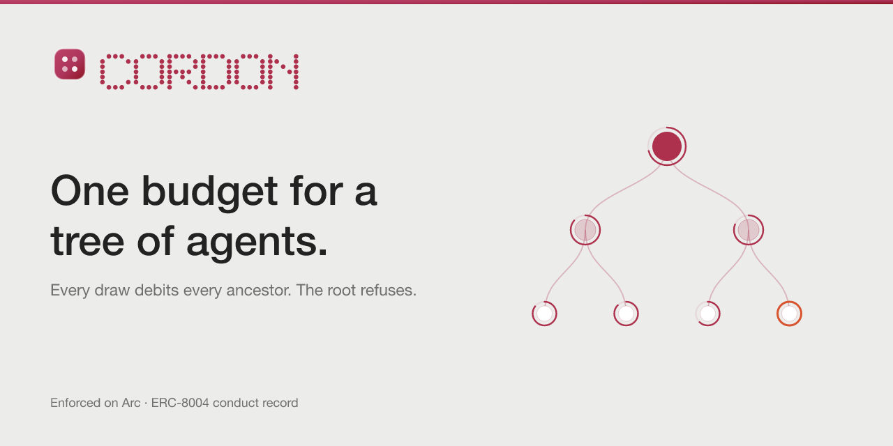

# @cordon/console



The owner's surface. Frontend only.

```bash
npm install
npm run dev      # http://localhost:5173/console/
npm run build
```

## What is here

| Route | |
|---|---|
| `/console` | **Overview** — what the tree may still spend, the agents worth a look, recent refusals, the signed terms |
| `/console/agents` | **Agents** — every agent as a list or a drawn tree; select one for its detail and to revoke it |
| `/console/refusals` | **Refusals** — every decision the contract made; select one for its detail and to release it |
| `/console/new` | **New mandate** — only when the owner has not opened one |

Old addresses keep working: `/console/setup?operator=…` goes to `/console/new`
with the query intact (older `npm run init` output prints it), `/console/tree`
goes to Agents, and `/console/drill` goes to the public drill page on the site.

## How it is laid out

One bar, three destinations, and who is signed in. No sidebar and no gate: a
reader without a wallet lands on the public tree with a one-line read-only
notice, and connecting is a button in the corner.

Actions sit where the decision is made. **Fund vault** and **Spawn agent** are
page actions in the top right. Revoking and releasing live in the side panel of
the agent or refusal they act on, because both are decisions about one thing
and should be taken while looking at it.

Colour and type are the `@cordon/ui` tokens and nothing else. `console.css`
defines layout — the bar, the page column, panels, tables, the sheet — and no
colour of its own; the accent is kept for the exception: an agent held by an
ancestor, a window past 90%, a revoked branch.

| | |
|---|---|
| `src/screens` | the four screens |
| `src/parts/Shell.tsx` | the bar, the notice, the page outlet |
| `src/parts/Page.tsx` | page header, panel, meter, skeleton, read failure |
| `src/parts/NodeDetail.tsx` | every field of one node, and which bound holds it |
| `src/parts/OwnerDialogs.tsx` | fund, spawn and revoke — each simulated before it is sent |
| `src/parts/TreeGraph.tsx` | the drawn tree |
| `src/lib` | wallet, chain reads, mandate transactions — unchanged by the layout |

## Two paths, and the console says which one you are on

**With a wallet.** `VITE_PRIVY_APP_ID` turns the gate real: Privy holds the
key, the owner logs in, and the address on screen is one that can sign on Arc.
Opening a mandate, funding the vault, spawning a child, revoking a branch and
releasing a refusal are then transactions from that key — each simulated first,
so an owner who is not the owner of a node is told before a wallet asks them to
sign anything. The tree and its figures are read from the registry and the
vault directly, with no indexer in between, because node ids are derived and
every node under an owner is reachable from that owner's address.

Privy holds the key; Cordon holds the bound. They answer different questions —
who may sign, and what may be signed for — and a policy inside the service that
holds a key is an off-chain control, which this project calls `declared`.

**Without one.** The gate falls back to a preview that touches no key:
`sessionStorage`, no signature, and every surface that depends on it says so.
The tree it shows is still the live one on Arc — it is not a tree of invented
agents — and what it does not have is any control that would fail at a wallet
nobody connected.

The one screen that is genuinely a drawing is the **sample tree**, shown when
no root has been opened: its `Draw $1` button and its revocations are local
state. They demonstrate the single thing worth demonstrating, which is that a
draw on a grandchild moves its grandparent's figure.

On the chain path there is **no draw control at all**. A draw is the daemon's
to make, and a button that pretended to make one from a table would be the
surface lying about what it can do. Revoking is different: it is the owner's
own transaction, and it is in the row.

## Two environment variables

| | |
|---|---|
| `VITE_PRIVY_APP_ID` | build-time. Unset, the wallet gate is the preview above — which looks like nothing is wrong |
| `VITE_METER_URL` | where `/refusal/:id` and the refusals list read from. Unset, the console reads the chain in windows and says how far back it got |

The drill gauge reads what G3 reached: 35.0% of the signed ceiling,
$0.007000 of $0.020000, stopped by `concentration` while the window still had
money in it. It is drawn from `drill.gen.ts`, which the run writes and nobody
types, and the figure is authority the tree granted rather than money that
left — no payment settled.
